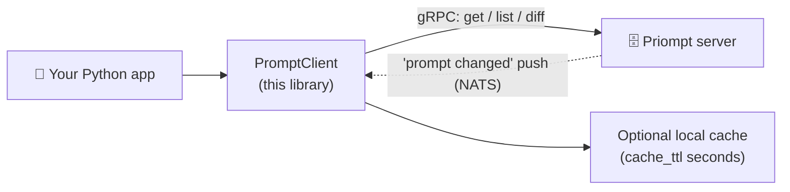
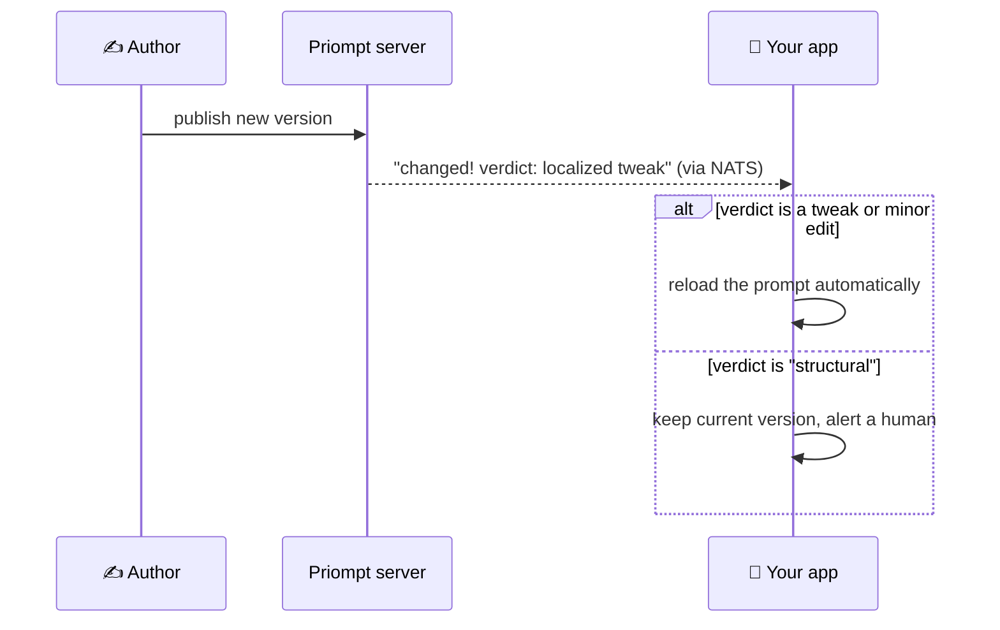

# Priompt Python client

**The piece your Python app imports to fetch its prompts.** Instead of
hard-coding prompt text in your source, your app asks a
[Priompt](https://github.com/) server for it by address — and can be notified
the moment a prompt changes.



## Install

```sh
pip install <dist-name>          # dist name TBD; imports as `priompt`
pip install "<dist-name>[nats]"  # add the [nats] extra if you use subscribe()
```

## Five lines to your first prompt

```python
from priompt import PromptClient

client = PromptClient(host="localhost:8443")            # token=... if auth is on
prompt = client.get("priompt://acme/onboarding/welcome")

print(prompt.template)                                  # Hi {name}, welcome to {org}!
text = prompt.template.format(name="Sujal", org="Acme")
```

What comes back from `get()`:

| Field | Example | Meaning |
| --- | --- | --- |
| `template` | `Hi {name}, welcome to {org}!` | The prompt text, with `{placeholders}` |
| `slots` | `['name', 'org']` | The blanks your app fills in |
| `version_hash` | `80ec4e4d…` | Fingerprint of this exact content |
| `commit_hash` | `1e8284…` | Set when you fetched a pinned `ref` — the commit you got |

## Connecting

One environment variable configures everything:
`PRIOMPT_URL=priompt://<token>@host:port` carries the address *and* the
credential, so `PromptClient()` with no arguments just works — and moving
between local, self-hosted, and cloud is a one-variable change.

```python
PromptClient(host=None, token=None, tls=False, ca_cert=None,
             cache_ttl=0, nats_url=None, url=None)
```

| Parameter | What it does |
| --- | --- |
| `host` | `address:port` of the server. Optional if `url` or `PRIOMPT_URL` is set |
| `url` | a full `priompt://<token>@host:port` string; defaults to `PRIOMPT_URL` |
| `token` | sent as `authorization: Bearer <token>`; explicit value wins over the url's token |
| `tls` / `ca_cert` | use TLS, optionally pinning a CA certificate |
| `cache_ttl` | local cache lifetime in seconds (`0` = off) — repeat `get`s within the TTL never touch the network |
| `nats_url` | endpoint for `subscribe()` |

## Everything the client can do

```python
client.get(uri, ref="")          # fetch a prompt (ref = branch or commit hash to pin a version)
client.list(prefix="")           # browse a repo (URI prefix) like a folder
client.diff(uri, new_template)   # semantic diff: stored version vs. your draft
client.subscribe(uri, on_change) # be notified the moment the prompt changes
client.close()
```

Browse a repo like a filesystem:

```python
for e in client.list("priompt://acme/support/"):
    print(e.uri, e.version_hash)
# priompt://acme/support/tier1/agent   1e8284f35650
# priompt://acme/support/tier2/agent   80ec4e4d88e6
```

Pin a version (ignore future changes until *you* decide to upgrade):

```python
prompt = client.get("priompt://acme/support/agent", ref="1e8284f35650")
```

## Live updates

When someone publishes a new version, the server pushes a notification that
includes a **semantic verdict** — how big the change really is. Your app can
auto-reload safe changes and hold dangerous ones for a human:



```python
client = PromptClient(host="…:8443", cache_ttl=30, nats_url="nats://…:4222")

def on_change(version, classification):
    if classification == "structural":
        alert_a_human(version)      # the meaning changed shape — review it
    else:
        reload(version)             # safe to pick up automatically

client.subscribe("priompt://acme/support/agent", on_change)   # needs the [nats] extra
```

Push is best-effort; the `cache_ttl` is the convergence guarantee — even a
missed notification only delays a refresh by one TTL.

## For maintainers of this library

`priompt/v1/` contains gRPC stubs generated from the shared **proto** repo
(`../proto` — the single source of truth for the contract; this repo carries
no copy). To regenerate after a proto change, install
[buf](https://buf.build/docs/installation) and run:

```sh
buf generate
```

Tests: `pip install -e . pytest && pytest -q`.

## TLS and mTLS

```python
# TLS with a private CA (the usual self-hosted case)
PromptClient(host="prompts.internal:8443", token="…", tls=True, ca_cert="ca.crt")

# mTLS — for a server started with -client-ca, which refuses connections
# without a certificate signed by that CA, before authentication runs
PromptClient(host="prompts.internal:8443", token="…", tls=True,
             ca_cert="ca.crt", client_cert="client.crt", client_key="client.key")
```

`ca_cert`, `client_cert` and `client_key` are file paths. `client_cert` and
`client_key` must be given together.
